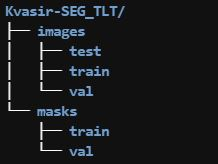

# clara-train_colonoscopy
---
A segmentation model of detecting polyps in colonoscopy developed by Clara Train SDK v3.1.
https://ngc.nvidia.com/catalog/containers/nvidia:clara-train-sdk </br>
https://docs.nvidia.com/clara/tlt-mi/

# Dataset
---
The dataset we used is Kvasir-SEG. The Kvasir-SEG dataset (size 46.2 MB) contains 1000 polyp images and their corresponding ground truth from the Kvasir Dataset v2. The resolution of the images contained in Kvasir-SEG varies from 332x487 to 1920x1072 pixels.


Debesh Jha, Pia H. Smedsrud, Michael A. Riegler, Pål Halvorsen, Dag Johansen, Thomas de Lange, and Håvard D. Johansen, Kvasir-SEG: A Segmented Polyp Dataset, In Proceedings of the ternational conference on Multimedia Modeling, Republic of Korea, 2020.

# Preparation
---
To fit with TLT, we have to:
- Prepare the folder structure as below,  



- Split the dataset into training, validation and testing set, 
- And convert the image format to PNG.  

Just follow the <a href="./Convert2TLT_format.ipynb">notebook</a> to prepare the data.

# Training
---
In Clara Train, the <a href="https://docs.nvidia.com/clara/tlt-mi/nvmidl/mmar.html">Medical Model ARchive, MMAR</a>, defines a standard structure for organizing all artifacts produced during the model development life cycle. We can define the pre-transformation, hyperparameters, loss function, model, metrics, data root in the configs and simply run the train.sh to train a model.
Follow the commands below in Clara Train SDK v3.1 container to start the training:
```
cd Colonoscopy_MMAR_v1/commands/
chmod +x train.sh
./train.sh
```

